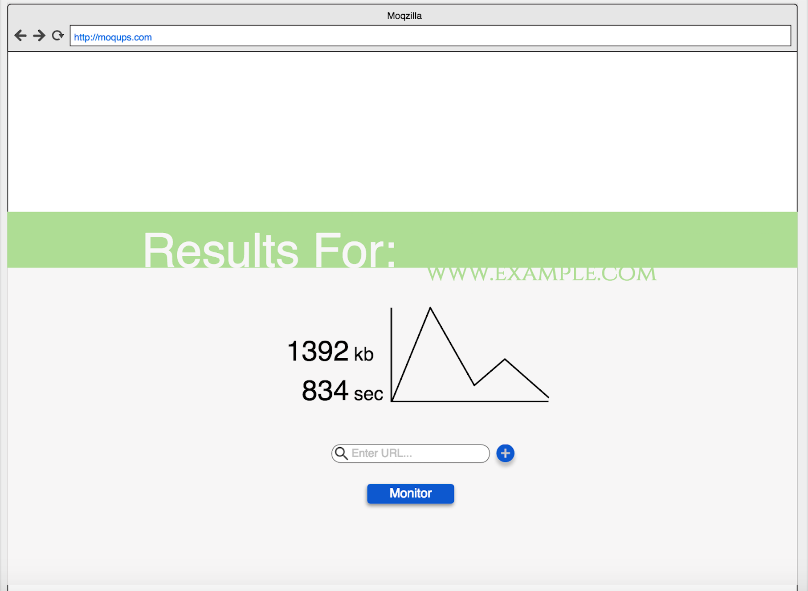

# e2-monitor-the-web
E2 Group Project for implementing an app to collect and display web page load time.
This app will consist of 3 features.

1.  This app will send a header response request to a URL, and retrieve data about load time and content size. (Assigned to Lauren Rouse)
2.  This app will visualize and graph the load time in a meaningful way. (Assigned to Ali Hamsa)
3.  This app will visualize and graph the content size in a meaningful way. (Assigned to Jonathan Hinton)

# Getting Started

1. Install Bower & npm from the assets/lib folder

```
bower install && npm install
```

# Application Mockup


